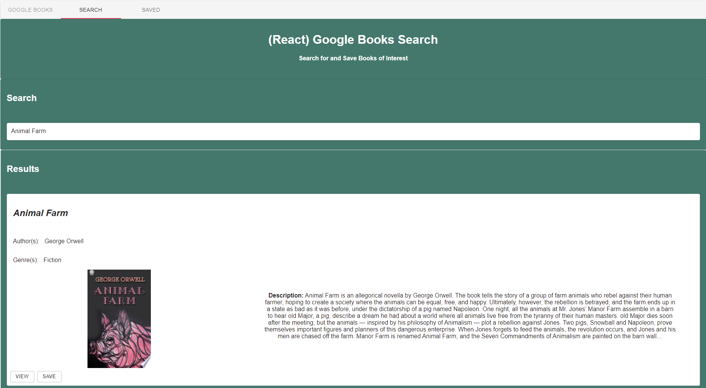
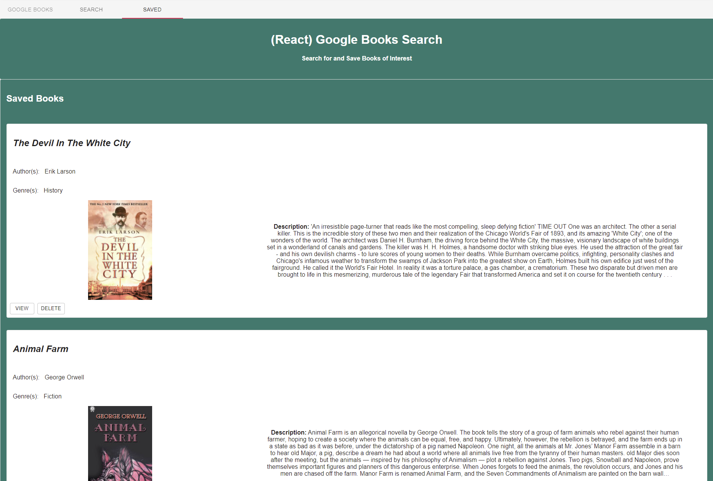
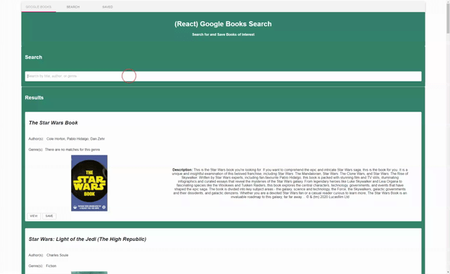
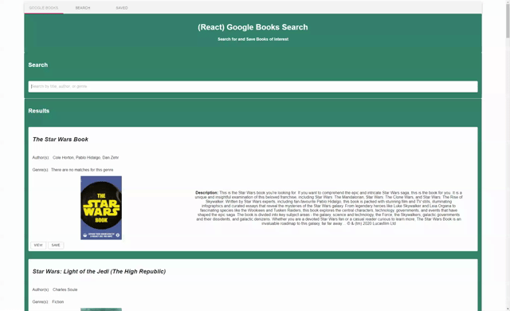

# Google Books Search 

## Table of Contents

- [Description](#description)
- [Technology Used](#technology)
- [Resources](#resources)
- [Licensing Information](#licensing)
- [Screenshots](#screenshots)
- [GIF Demonstration](#demonstrations)
   
   

## Description

This is a full-stack project using MongoDB, Express.js, React.js and Node.js to build a Google Books website. When the user first visits the book search, they will first see the search page. A search for _Star Wars_ is the default search. The user can search by title, author, or genre and as they type, the user begins to see results below. When the user finishes typing, and finds the book they desire, the user can choose to view the book on the Google Books website, or the user can click _Save_ to save it to their saved list.

When the user navigates to the _Saved_ tab in the navbar, they will be taken to a page with a list of their saved books. Here, the user can choose to view on Google Books website, or delete the book from their list.

### Please follow [this link](https://google-books-search-824.herokuapp.com/) to view the live application.

 

## Technology

- MongoDB
- Mongooese
- Express.js
- React.js
- Node.js
- Google Books API
- Material-UI

 
 

## Resources

- [Mongoose Scheme Types](https://mongoosejs.com/docs/schematypes.html)
- [React Documentation](https://reactjs.org/)
- [Google Books API](https://developers.google.com/books/docs/v1/using)
- [Adding Comma Between an Array in React](https://stackoverflow.com/questions/47881767/how-to-add-a-comma-in-array-map-after-every-element-except-last-element-in-react)
- [Material-UI Documentation](https://material-ui.com/)
   
   

## Licensing Information

This project is covered under the MIT license.

## Screenshots

## Demonstrations

### Search by Title

### Search by Author

### Search by Genre

### View Saved and Delete

